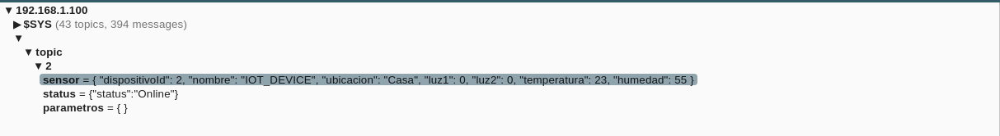

# Sensor node for IOT
## Descripcion general

Este pequeño proyecto contiene el firmware para un nodo con:
* sensado de temperatura 
* humedad 
* 2 leds de activación remota 

El nodo utiliza MQTT con certificados TLS y el dispositivo sensor es el módulo DTH11.

El nodo reporta las mediciones mediante una tarea llamada"sensor_task()" cada 30 segundos. \
La tarea "comm_task()" chequea si se recibió un mensaje desde otro dispositivo. Esto lo realiza comprobando el estado del flag "flagProcessMessage" activado desde el mqtt_event_handler definido en "mqtt_functions.c".

El nodo sensor genera 3 tópicos:

* sensor: topico en el cual el nodo reporta los valores de temperatura y humedad en formato JSON.\
{\
	"dispositivoId":	2,\
	"nombre":	"IOT_DEVICE",\
	"ubicacion":	"Casa",\
	"luz1":	0,\
	"luz2":	0,\
	"temperatura":	22,\
	"humedad":	55\
}
* status: Topico en el cual el nodo reporta el status:\
{"status":"Online"}\
\
En este tópico se reporta el ***Last Will and Testament***, que se encuentra configurado para activarse despues de 60 segundos sin reporte.

* parametros: en este tópico se puede actualizar los parametros del sensor, o bien encender y apagar los leds. Los Json que se deben enviar son: 
    * Para actualizar leds: \
        {"Led1":1,"Led2":0}
    * Para actualizar nombre u ubicacion(tanto nombre como ubicacion deben poseer como maximo 24 caracteres):    
    {"nombre":"mi lindo nodo sensor","ubicacion":"casa"}

## Configuracion en detalle del nodo

Configurar los datos de la red WiFi en wifi_config.h con los siguientes defines que se encuentran al inicio del archivo.

`#define EXAMPLE_ESP_WIFI_SSID      "your_SSID"`\
`#define EXAMPLE_ESP_WIFI_PASS      "your_SSID_PASSWORD"`\
`#define EXAMPLE_ESP_MAXIMUM_RETRY  10`

Para configurar el la ubicación del broker mosquitto, editar mqtt_functions.h:

`#define BROKER_URI "mqtts://192.168.1.100:8883"`

Para configurar parametros por default del sensor, editar sensor_config.h:

`int dispositivoId = 2;`\
`int Luz1=0;`\
`int Luz2=0;`

`char nombre[25]="IOT_DEVICE";`   
`char ubicacion[25]="Casa";`   

Con excepcion del dispositivoId, todos los demas valores pueden ser actualizados remotamente.

## Salida por consola
\
En estado normal de trabajo presenta la temperatura y humedad obtenidad, asi como los errores que pueden surgir en la lectura del dispositivo.

`t: 22.000000`\
`h: 55.000000`

En caso de recibir un mensaje de configuracion se imprime la información recibida:\
`I (131208) sensor: MQTT_EVENT_DATA`\
`processing incoming`\
`{"nombre":"mi lindo nodo sensor","ubicacion":"casa"}`\
`:`\
`Checking device name "mi lindo nodo sensor"`\

En caso de recibir un mensaje de activación de leds se imprime la información recibida.\
`I (355668) sensor: MQTT_EVENT_DATA`\
`processing incoming`\
`{"Led1":1,"Led2":0}`\
`:`

## Trabajo para mejorar
* No utilizar credenciales fijas
* Un modo mejor de generar Id de dispositivos
